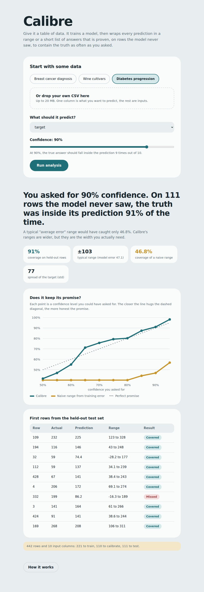

# Calibre

**Predictions with an awareness of their own uncertainty.**

Calibre accepts any tabular dataset (CSV) file, learns a model, and gives every prediction a *range* (for numerical predictions) or *short list of possible values* (for categorical predictions). The range/possible values is accompanied by a statistical guarantee that 90% of confidence intervals contain the correct answer and that Calibre evaluates this coverage on rows unseen by the model.



## Why it was built

A model stating that "house price is 240,000" cannot be used for any decisions unless you know whether it could be wrong by 5,000 or 100,000. While the standard approach of "average error ± some margin" looks good on surface, it is very misleading since model's own estimate of error is orders of magnitude smaller than its error on new data.

On the default diabetes dataset, estimating 90% confidence range:

| Range construction technique | Actual coverage of range on hold-out rows |
| --- | --- |
| Naive range based on training data | **46.8%** (promised 90%) |
| Calibre (split conformal prediction) | **91.0%** |

The model and the data are the same. Just the technique to estimate the uncertainty is different.

## Running Calibre

You need Python 3.10 or above.

```bash
git clone <https://github.com/twnar/Calibre>
cd calibre
python -m venv .venv
source .venv/bin/activate        # On Windows: .venv\Scripts\activate
pip install -r requirements.txt
python app.py
```
Open http://127.0.0.1:5000, select a sample dataset (or load in your own .csv file), select the column to predict, and click **Run analysis**.

Test the code using `python -m pytest`.

## What's happening

Calibre implements **split conformal prediction** from scratch in 70 lines of Python and NumPy (`calibre/conformal.py`).

1. Rows are split 50% train / 25% calibration / 25% test (stratified for classification).
2. A random forest is fitted on the training rows only.
3. On the calibration rows, Calibre calculates the error of the model: `|actual - predicted|` for regression, or `1 - p(actual class)` for classification.
4. It calculates the finite-sample-corrected quantile of these error scores: `ceil((n+1)(1-α))/n` and uses it to define each range or class list size.
5. The unused test rows then check if the guarantee was met. These values are outputted by the application.

The guarantee only requires the calibration and future datasets to be *exchangeable* (roughly speaking: drawn from the same distribution). No assumptions are made about the performance of the model or its distribution. A poor-performing model will just provide wider confidence intervals.

## What's in the repo

```
app.py                  Flask server (3 routes)
calibre/conformal.py    The conformal prediction maths
calibre/pipeline.py     Cleaning, splitting, training, evaluation
calibre/datasets.py     In-built example datasets (from scikit-learn)
templates/, static/     The UI (HTML/CSS/JS only; no build process)
tests/                  Unit tests (including Monte Carlo coverage test)
```

## Limitations

- The guarantee is **only marginal**: it works on average over all rows, not for each individual subgroup. The range may be too narrow for difficult rows and too wide for easy rows.
- Ranges for regressions are **fixed-width**. Conformalised quantile regression and normalised residuals provide adaptive approaches which would give more accurate ranges for easy rows.
- If the test data is not drawn from the same distribution as the calibration data, then the guarantee will not hold; re-run on new data.
- Currently, only random forests; automatic cleaning is deliberately very basic (fill missing with median, one hot encoding, remove ID like text columns).
- On small datasets, coverage on the test data is noisy, the Monte Carlo test in `tests/` confirms the guarantee holds on average.

## Directions for future work

- Conformalized quantile regression with adaptive width
- Group-level coverage diagnostics (by category)
- Drift detection where an alert is raised if the new data does not look similar to the calibration data anymore
- Model selection (gradient boosting, linear models) along with individual comparisons

## Bibliography

- Vovk, Gammerman, Shafer. *Algorithmic Learning in a Random World* (2005).
- Angelopoulos, Bates. *A Gentle Introduction to Conformal Prediction and Distribution-Free Uncertainty Quantification* (2021).

## License

MIT
